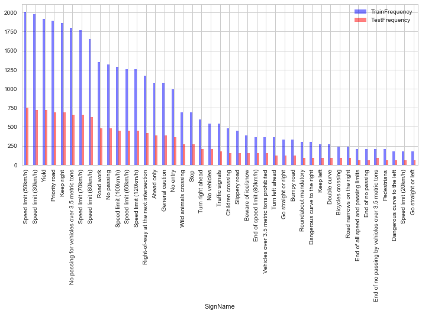
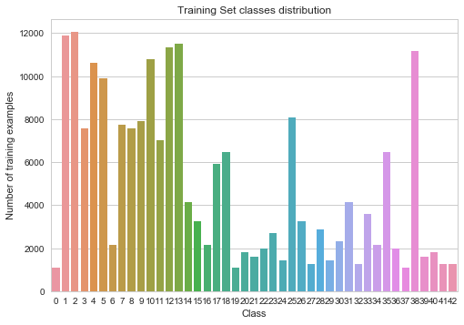
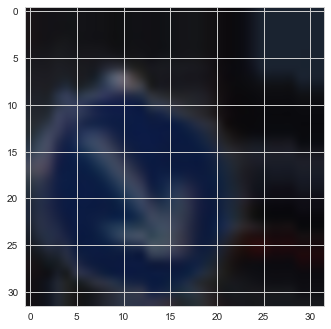
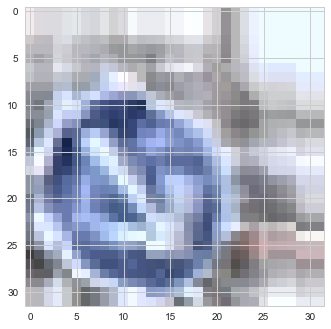
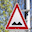
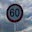
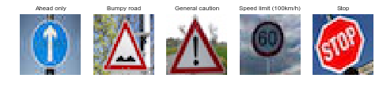
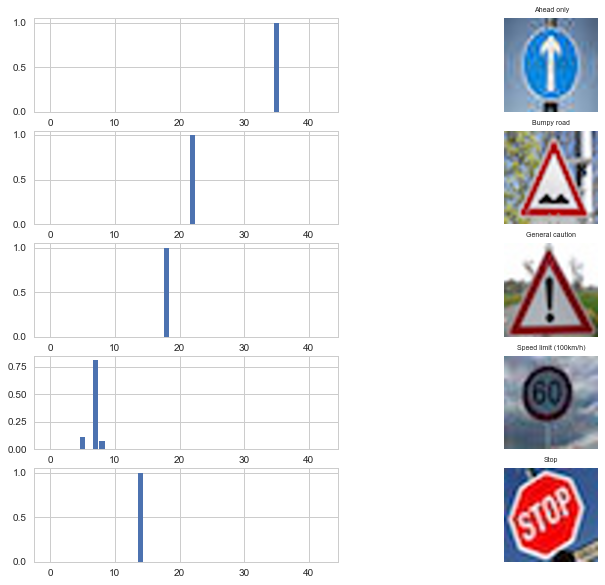

#**Traffic Sign Classification using Convolutional Neural Networks + TensorFLow** 

**Build a Traffic Sign Recognition Project**

The goals / steps of this project are the following:
* Load the data set (see below for links to the project data set)
* Explore, summarize and visualize the data set
* Design, train and test a model architecture
* Use the model to make predictions on new images
* Analyze the softmax probabilities of the new images
* Summarize the results with a written report

## Rubric Points
###Here I will consider the [rubric points](https://review.udacity.com/#!/rubrics/481/view) individually and describe how I addressed each point in my implementation.  

---
###Writeup / README

####1. Provide a Writeup / README that includes all the rubric points and how you addressed each one. You can submit your writeup as markdown or pdf. You can use this template as a guide for writing the report. The submission includes the project code.

You're reading it! and here is a link to my [project code](https://github.com/andersy005/self-driving-car-nd/blob/master/Project2-Traffic-Sign-Classification/Traffic_Sign_Classifier%20.ipynb)

###Data Set Summary & Exploration

####1. Provide a basic summary of the data set and identify where in your code the summary was done. In the code, the analysis should be done using python, numpy and/or pandas methods rather than hardcoding results manually.

The code for this step is contained in the third code cell of the IPython notebook.  

I used the NumPy library to calculate summary statistics of the traffic
signs data set:

- Number of training examples = 34799
- Number of validation examples = 4410
- Number of testing examples = 12630
- Image data shape = (32, 32, 3)
- Number of classes = 43

####2. Include an exploratory visualization of the dataset and identify where the code is in your code file.

The code for this step is contained in the fourth code cell of the IPython notebook.  

Here is an exploratory visualization of the data set. It is a bar chart showing how the number of each sign in the 
training and testing sets.

~ Exploratory Data Analysis
==========================

- After examining the provided training dataset for the distribution of the various classes, the classes were found to be highly imbalanced indicating the need to generate new data for the under-represented classes such as class-19, class-27, class-37 to name a few.

- The images differ significantly in terms of contrast and brightness. As a result, we will need to apply some kind of data processing to improve feature extraction.

###Design and Test a Model Architecture

####1. Describe how, and identify where in your code, you preprocessed the image data. What tecniques were chosen and why did you choose these techniques? Consider including images showing the output of each preprocessing technique. Pre-processing refers to techniques such as converting to grayscale, normalization, etc.

The code for this step is contained in the 11th up to 28th  code cells of the IPython notebook.

* For Data Pre-processing, I decided to apply [Contrast Limited Adaptive Histogram Equalization](http://www.cs.utah.edu/~sujin/courses/reports/cs6640/project2/clahe.html) algorithm in the [Lab color space](https://en.wikipedia.org/wiki/Lab_color_space) to do the contrast enhancement.

* In addition to contrast enhancement, I normalized the images between 0-1.

* As Pierre Sermanent and Yann LeCun mentioned in their [Traffic Sign Recognition with Multi-Scale Convolutional Networks](http://yann.lecun.com/exdb/publis/pdf/sermanet-ijcnn-11.pdf) paper, using color channels didn't seem to improve things a lot and by using grayscale images they still got high accuracy. Nonetheless, I chose to experiment with colored images.

* The following functions from [TFLearn Library](http://tflearn.org/data_augmentation/#image-augmentation) were used for **image augmentation**. The reason behind the image augmentation is the fact that our original training set was highly imbalanced. 

####2. Describe how, and identify where in your code, you set up training, validation and testing data. How much data was in each set? Explain what techniques were used to split the data into these sets. (OPTIONAL: As described in the "Stand Out Suggestions" part of the rubric, if you generated additional data for training, describe why you decided to generate additional data, how you generated the data, identify where in your code, and provide example images of the additional data)

As stated above, our original training data was highly imbalance. Feeding our ConvNet with a balanced dataset helps it learn better.
I've decided to generate augmented data through three techniques by adding the following trasnformations.
- Rotation (-10 , 10 )
- Shifting (-5 , 5 )
- Shearing (-5 , 5 )

Then for each image, I generated 5 additional images with 5 by randomly rotating, shifting and shearing it.

After Image Augmentation, our training set size was (208794, 32, 32, 3) as it's  shown as the output of the 20th code cell in IPython notebook.

The following figure is the new distribution of signs for each class.

- Max observations: 12060
- Min observations: 1080

Here is an example of a traffic sign image afte data augmentation

Here is the same example after data pre processing.

The provided data had the data splitted into training and validation sets.

####3. Describe, and identify where in your code, what your final model architecture looks like including model type, layers, layer sizes, connectivity, etc.) Consider including a diagram and/or table describing the final model.

The code for my final model is located in the 55th cell of the ipython notebook. 

My final model consisted of the following layers:

| Layer         		|     Description	        					| 
|:---------------------:|:---------------------------------------------:| 
| Input         		| 32x32x3 RGB image   							| 
| Convolution 3x3     	| 1x1 stride, VALID padding, outputs 28x28x6 	|
| RELU	                |                                               |
| Dropout  				| 60%											    |
| Convolution	      	| 1x1 stride,  VALID padding, outputs 10x10x16 	|			|
| RELU          	    |      							                |
| Dropout       		| 60%      								     	|
| Flatten				|        								     	|
| Fully Connected       | Input = 1600    Output = 400                  |      						|												|
| RELU					|												|
| Fully Connected       | Input = 400   Output = 120                    |
| RELU                  |                                               |
| Fully Connected(logits)| Input = 120 Output = 43                      |             |

####4. Describe how, and identify where in your code, you trained your model. The discussion can include the type of optimizer, the batch size, number of epochs and any hyperparameters such as learning rate.

The code for training the model is located in the 59th cell of the ipython notebook. 

To train, validate, and test the model, I used 

- Number of training examples = 208794 
- Number of validation examples = 4410
- Number of testing examples = 12630
- Image data shape = (32, 32, 3)
- Number of classes = 43

####5. Describe the approach taken for finding a solution. Include in the discussion the results on the training, validation and test sets and where in the code these were calculated. Your approach may have been an iterative process, in which case, outline the steps you took to get to the final solution and why you chose those steps. Perhaps your solution involved an already well known implementation or architecture. In this case, discuss why you think the architecture is suitable for the current problem.

The code for calculating the accuracy of the model is located in the 58th cell of the Ipython notebook.

My final model results were:
* training set accuracy of **99.8 %**
* validation set accuracy of **94.5%**
* test set accuracy of **94.1%**

My model is based on Yann Lecun's LeNet Architecture. I added two dropout layers to prevent the ConvNet from co-adapting too
much which made overfitting less likely.

###Test a Model on New Images

####1. Choose five German traffic signs found on the web and provide them in the report. For each image, discuss what quality or qualities might be difficult to classify.

Here are five German traffic signs that I found on the web:

The fourth image might be difficult to classify due to low brightness and contrast.
The fifth image might also be difficult to classify because it's rotated...

####2. Discuss the model's predictions on these new traffic signs and compare the results to predicting on the test set. Identify where in your code predictions were made. At a minimum, discuss what the predictions were, the accuracy on these new predictions, and compare the accuracy to the accuracy on the test set (OPTIONAL: Discuss the results in more detail as described in the "Stand Out Suggestions" part of the rubric).

The code for making predictions on my final model is located in the tenth cell of the Ipython notebook.

Here are the results of the prediction:

1. Image-1 is identified **(correctly)**
2. Image-2 is identified **(correctly)**
3. Image-3 is identified **(correctly)**
4. Image-4 is identified **(incorrectly)**
5. Image-5 is identified **(correctly)**

The model was able to correctly guess 4 of the 5 traffic signs, which gives an accuracy of 80%. This compares favorably to the accuracy on the test set.

####3. Describe how certain the model is when predicting on each of the five new images by looking at the softmax probabilities for each prediction and identify where in your code softmax probabilities were outputted. Provide the top 5 softmax probabilities for each image along with the sign type of each probability. (OPTIONAL: as described in the "Stand Out Suggestions" part of the rubric, visualizations can also be provided such as bar charts)

The code for making predictions on my final model is located in the 71th cell of the Ipython notebook.

For the first image, the model is relatively sure that this is an 'Ahead Only' sign (probability of 0.999), and the image does contain an Ahead Only sign. 

For the second image, the model is relatively sure that this is a 'Bumpy Road' sign (probability of 0.997), and the image does contain a Bumpy Road sign.

For the third image, the model is relatively sure that this is a 'General Caution' sign (probability of 0.999), and the image does contain General Caution sign.

For the fourth image, the model is relatively sure that this is a 'Speed limit(100km/h)' sign (probability of 0.81). Though this prediction is incorrect, the image contains a Speed limit sign. It's clear
that the model was not very confident about this one. In fact, the model gave 0.11 probabilily to Speed limit (80km/h) and 0.071 probability to Speed limit (120km/h).

For the fifth image, the model is relatively sure that this is a 'Stop' sign (probability of 0.999), and the image does contain a Stop sign.

The following is the bar chart of the top five soft max probabilities for each predicted sign:

 

