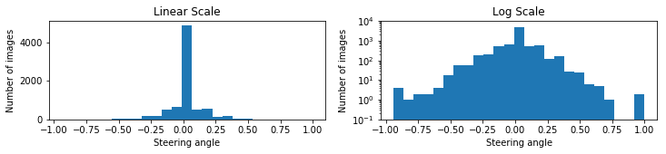
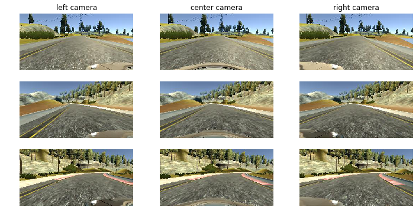
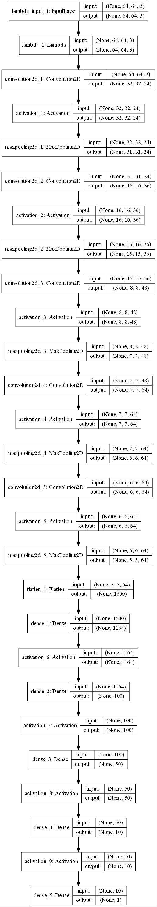
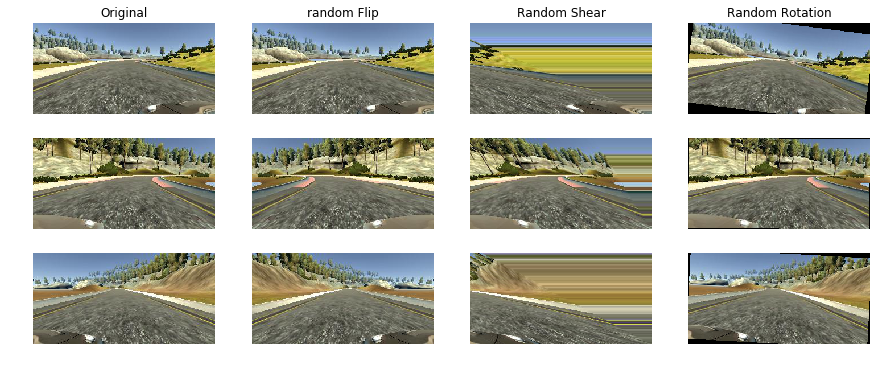
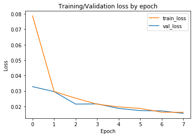
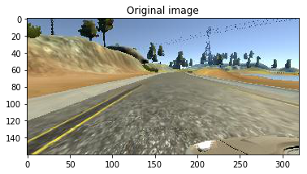
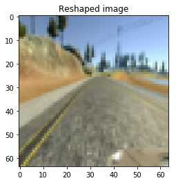
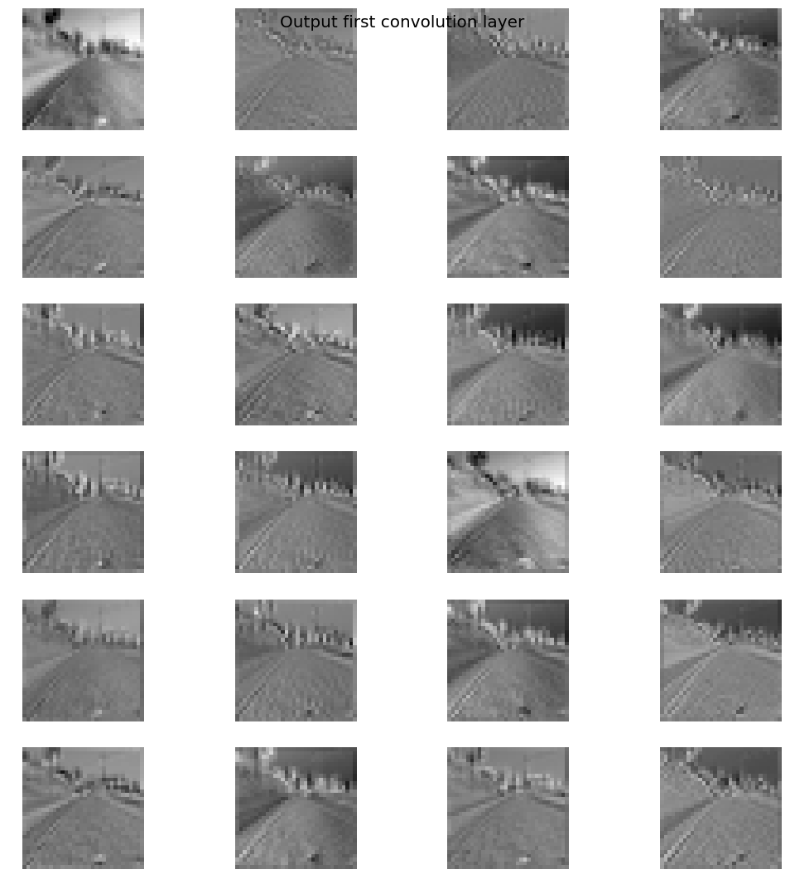
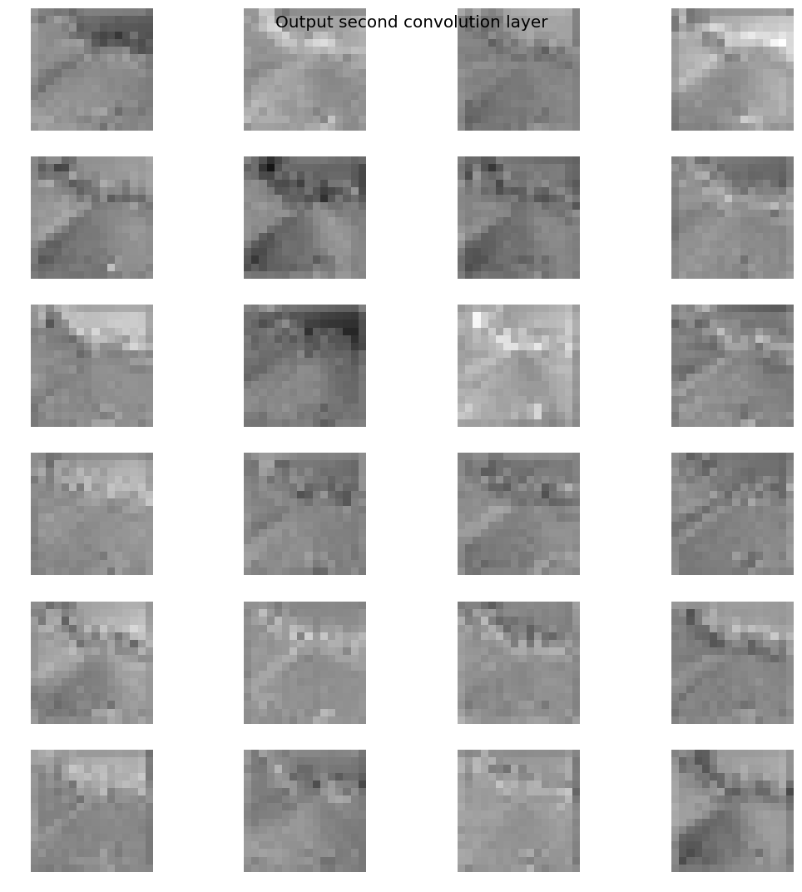

# Project: Behaviorial Cloning Project

Overview
---
This repository contains starting files for the Behavioral Cloning Project.

In this project, I use deep neural networks and convolutional neural networks to clone driving behavior. I trained, validated and tested a model using Keras. The model outputs a steering angle to an autonomous vehicle in a simulator provided by Udacity.

### Overview of the project directory:
- Train model: Run `python model.py`
- Final model saved weights: model.h5
- Final model saved architecture: model.json
- Behavioral.ipynb has the code to generate the graphs included in this README and some extra ones and **has the model performance video** embedded in it in **cell 21**.
- drive.py is used to generate the steering angles used by the simulator
.

## Dataset:
I wasn't able to drive the car well enough with my laptop keyboard to get good data. Therefore, I used the dataset provided by Udacity.
The dataset is composed of the following: 
- images from 3 different cameras placed at the center, left and right of the car and 
- their associated steering angle, throttle, brake and speed.

### Data analysis:
- Some points in the dataset were recorded with a very low speed. These may be outliers and I decided to remove them.
- Steering angles have an uneven distribution: there are more sharper left turns in the data set. Also, there is a huge peak around 0, which means that the model may have a bias to go straight. If we include the left and right cameras with an steering angle offset, this can fix the problem.

Some Random dataset images visualization

### Validation set:
In order to pick the best model and avoid overfitting, 10% of the training dataset was randomly selected for validation.
- Total number of examples: 7,332
- Training examples: 6,598
- Validation examples: 734

### Model description:
I implemented a model based on the model described in the [NVIDIA paper](http://images.nvidia.com/content/tegra/automotive/images/2016/solutions/pdf/end-to-end-dl-using-px.pdf) in Keras. I used the same layers but fed RGB images instead of YUV images since RGB images gave better results.

More implementation details:
- Adam optimizer with learning rate of 1e-4.
- Metrics to optimize: minimize mean_squared_error.
- Batch generator in order to generate more random images from the dataset. 
- ModelCheckpoint to save model weights after each epoch. This was useful since I realized that the validation loss was not always better correlated to the performance on the track so I was able to easily run the simulator for models of different epochs.

### Data preprocessing & Data Augmentation:

For Image preprocessing, I apply the following steps:
- **Crop image**: crop the top by 35% to remove things above horizon(such as sky etc) and the bottom by 10% in order to remove the car hood.

- **Resize image**: All images are resized to 64x64 pixels

- **Random gamma** correction is used as an alternative method changing    the brightness of training images.

The following image augmentations are performed real time during training :

- ** Random Flip** : Images are flipped about vertical axis and the sign of steering sign is changed. This leads to better generalization for new datasets.
- **Random Shear** 

- **Random Rotation**

The data augmentation operation in action

### Model training:
I included around 20,032 examples in each epoch.
I ran the model for at most 8 epochs. I initially selected the model with the lowest validation loss. However, after noticing that some of my earlier models with less data generation had lower validation loss by performed worse on the track, I started to test the simulator for models at different epochs from the one with the lowest validation loss.

I was able to train the model on my local machine in less than 5 minutes per epoch, 
so 40 minutes total for 8 epochs.

- Plot of training and validation loss (mean_squared_error)

### Output of first and second convoluational layers
sample Image is used for visualization purposes
- Original Sample Image:

- Resized Sample Image:

- Output of First convolutional layer:

- Output of Second convolutional layer:

### Other data generation tried that did not work:
- Change brightness
- Add image rotation
- Convert image to YUV space

### Running the simulation:
- I updated the drive.py file to make the necessary image transformations to the input image before feeding it to the model: crop top and bottom of image and resize it to 64x64x3.

### Observations:
- Car drives well on first track but performs poorly on the second track.
- At higher speeds, the car makes more zigzags. I wonder if it is a limitation of the simulator that is not fast enough.
- The simulator is not performing well when other applications are running as well (e.g. training another model)
- Some models have lower validation losses but perform poorly on the track.
- When using the silmulator at higher screen resolutions, the model performs as well.
- When using the silmulator with highest graphic quality, my laptop struggles and the car does not drive as well. We could generate random shadows to improve it.

