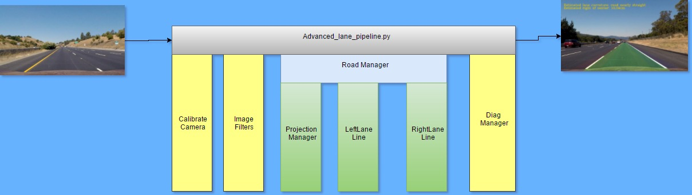

# Udacity Self-Driving Car Project 4: Advanced Lane Finding

The goals / steps of this project are the following:

* Compute the camera calibration matrix and distortion coefficients given a set of chessboard images.
* Apply a distortion correction to raw images.
* Use color transforms, gradients, etc., to create a thresholded binary image.
* Apply a perspective transform to rectify binary image ("birds-eye view").
* Detect lane pixels and fit to find the lane boundary.
* Determine the curvature of the lane and vehicle position with respect to center.
* Warp the detected lane boundaries back onto the original image.
* Output visual display of the lane boundaries and numerical estimation of lane curvature and vehicle position.

## 1. Components and Modulization

To achieve the design goals, we create a pipeline made of 7 components. Each of these are described here briefly.

1. **CalibrateCamera:** Python class that handles camera calibrations operations
2. **ImageFilters:** Python class that handles image analysis and filtering operations
3. **ProjectionManager:** Python class that handles projection calculations and operations
4. **Line:** Python class that handles line detection, measurements and confidence calculations and operations.  There are two instances of this class: LeftLane and RightLane.
5. **RoadManager:** Python class that handles image, projection and line propagation pipeline decisions
6. **DiagManager:** Python class that handles diagnostic output requests
7. **advanced_lane_pipeline.py:** Main Python CLI component that handles input/output filename checking, option selections and media IO.

This is a block diagram of how the classes are organized to process an image or a video (sequence of images):
