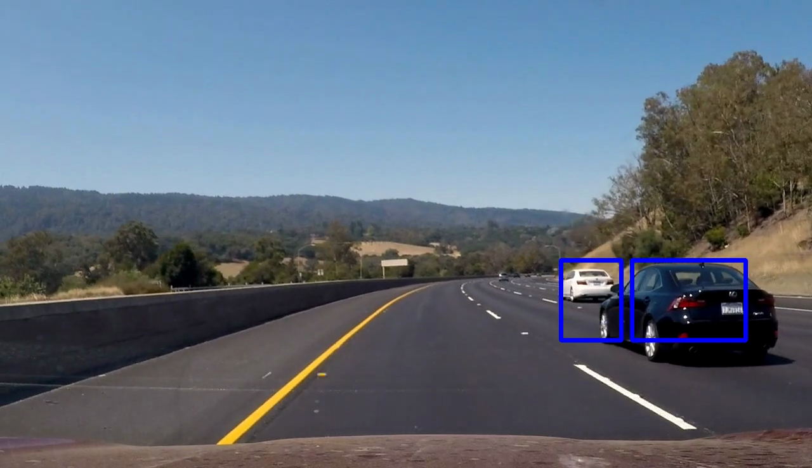
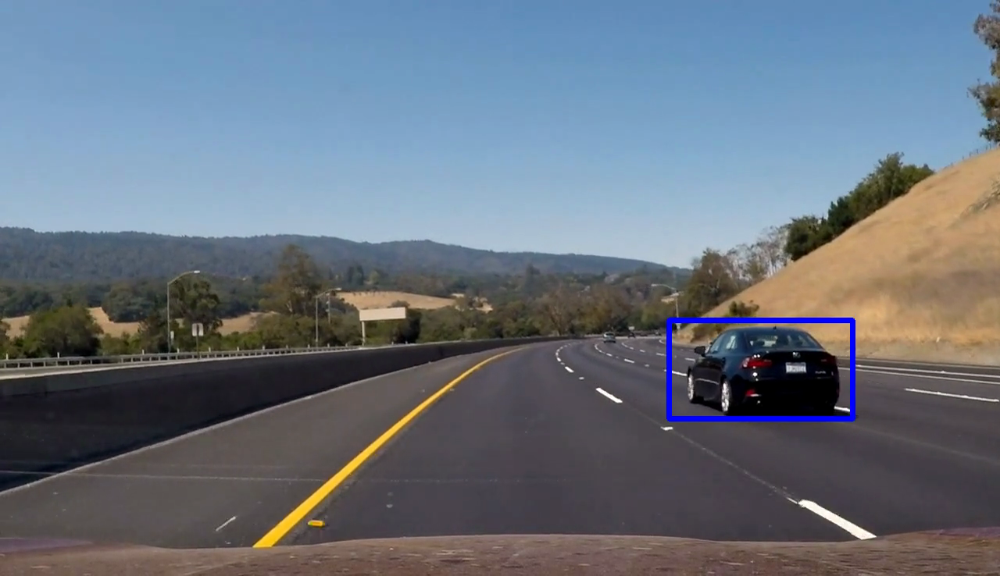
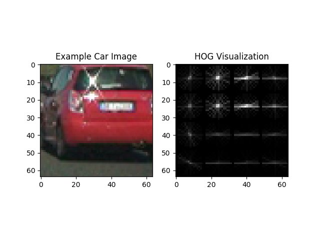
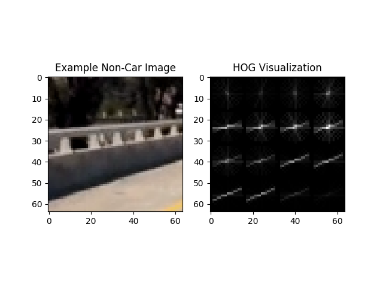
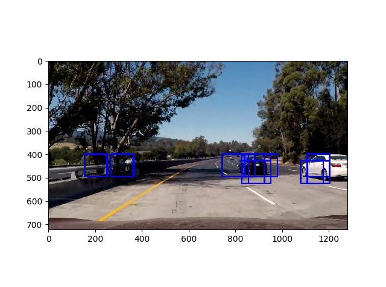
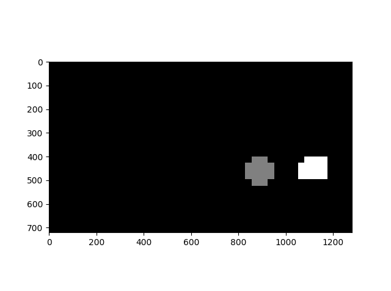
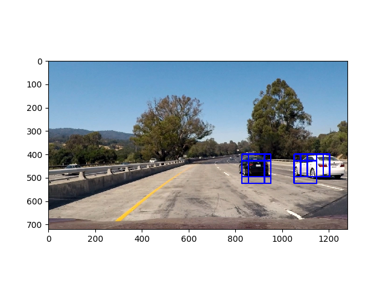

# Vehicle Detection




[Final video output](https://youtu.be/a2RHR6K47WU)

## Overview
Detect vehicles using HOG + SVM classifier with sliding windows. This project is part of the [Udacity Self-Driving Car Nanodegree](https://www.udacity.com/drive), and much of the code is leveraged from the lecture notes.

The overall pipeline is the following:

* Gather and organize the data
* Perform a Histogram of Oriented Gradients (HOG) feature extraction on a labeled training set of images
* Train a linear SVM classifier on normalized HOG features
* Implement a sliding-window technique and use trained classifier to search for vehicles in images
* Run the above steps on a video stream and create a heat map of recurring detections frame by frame to reject outliers and follow detected vehicles.
* Estimate a bounding box for vehicles detected.

## Pipeline details
### Gather and organize the data
We downloaded Udacity's data for this project, in which Udacity provided [vehicle](https://s3.amazonaws.com/udacity-sdc/Vehicle_Tracking/vehicles.zip) and [non-vehicle](https://s3.amazonaws.com/udacity-sdc/Vehicle_Tracking/non-vehicles.zip) images of size 64x64 pixels. The vehicle and non-vehicle images were extracted from the [GTI](http://www.gti.ssr.upm.es/data/Vehicle_database.html) and [KITTI](http://www.cvlibs.net/datasets/kitti/) datasets.

After downloading the data, we ran `python pickle_data.py` to create 'data.p' in the working directory. The pickle file 'data.p' contains numpy arrays representing the vehicle and non-vehicle images. For more details please refer to the code in 'pickle_data.py'.

The following is an example of an image in the "vehicle" class:


The following is an example of an image in the "non-vehicle" class:


### Histogram of Oriented Gradients (HOG)
At the highest level, the code to extract features is in the function `extract_features()` in the file 'features.py'. More specifically, the code to extract HOG features is in the function `get_hog_features()` in the file 'features.py'. It uses scikit-learn's `hog()` function.

To extract the optimal HOG features, we experimented with different color spaces and tweaked different parameters. Via trial-and-error, we iterated through multiple loops of HOG feature parameter tweaking, visualizing static images, visualizing the final effect on video, more HOG feature parameter tweaking, etc.

After much experimentation, we settled on the following HOG feature extraction parameters:

* Color space: RGB
* Channel: (all)
* Orientations: 30
* Pixels per cell: 16
* Cells per block: 2

The above parameters are hard-coded in the file 'config.py'.

Below is a visualization of the HOG features on the example vehicle and non-vehicle images.

Vehicle HOG:



Non-vehicle HOG:



Visually we can see that the HOG representation of the vehicle is significantly different than that of the non-vehicle example.

Note: spatial binning and color histograms were not, as we did not find them helpful from the experimentation.

### Train a linear SVM classifier
After the HOG features have been extracted for each training image, a linear SVM classifer was trained using these features. The code to do so is in the function `train()` in the file 'train.py'.

In the function `train()`, we first extract the HOG features via `extract_features()`. Then, we intentionally unbalance the data, such that the non-vehicle to vehicles ratio is 3:1, via the following line of code: `X = np.vstack((car_features, notcar_features, notcar_features, notcar_features)).astype(np.float64)`.

After the above, we normalize the features by using scikit-learn's StandardScaler.
```python

# Train SVM
def train(cars, notcars, svc, X_scaler):
	car_features = extract_features(cars, color_space=color_space,
							spatial_size=spatial_size, hist_bins=hist_bins,
							orient=orient, pix_per_cell=pix_per_cell,
							cell_per_block=cell_per_block,
							hog_channel=hog_channel, spatial_feat=spatial_feat,
							hist_feat=hist_feat, hog_feat=hog_feat)
	notcar_features = extract_features(notcars, color_space=color_space,
							spatial_size=spatial_size, hist_bins=hist_bins,
							orient=orient, pix_per_cell=pix_per_cell,
							cell_per_block=cell_per_block,
							hog_channel=hog_channel, spatial_feat=spatial_feat,
							hist_feat=hist_feat, hog_feat=hog_feat)

	X = np.vstack((car_features, notcar_features, notcar_features, notcar_features)).astype(np.float64)
	# Fit a per-column scaler
	X_scaler.fit(X)
	# Apply the scaler to X
	scaled_X = X_scaler.transform(X)

	# Define the labels vector
	y = np.hstack((np.ones(len(car_features)), np.zeros(3*len(notcar_features))))

	# Split up data into randomized training and test sets
	rand_state = np.random.randint(0, 100)
	X_train, X_test, y_train, y_test = train_test_split(
		scaled_X, y, test_size=0.05, random_state=rand_state)

	print('Using:',orient,'orientations',pix_per_cell,
		'pixels per cell and', cell_per_block,'cells per block')
	print('Feature vector length:', len(X_train[0]))
	# Use a linear SVC
	#svc = LinearSVC()
	# Check the training time for the SVC
	t=time.time()
	svc.fit(X_train, y_train)
	t2 = time.time()
	print(round(t2-t, 2), 'Seconds to train SVC...')
	# Check the score of the SVC
	print('Test Accuracy of SVC = ', round(svc.score(X_test, y_test), 4))
```

Using a train/test split of 95/5, we trained the SVM, and saved the final trained model to 'model.p'. we did not find the final test accuracy to be a good proxy of how well the vehicle detector performed, and we was getting 95%+ test accuracy in all of our parameter tuning experiments. Since we didn't find the test accuracy to be very useful, we used a very small percentage of the training data for our test set, 5%. Originally we used 20% of the data for the test set.

The final results after training were:


### Sliding window search
we implemented a basic sliding window search to detect areas in the image/video where a vehicle is likely present. A window size of 96x96 pixels worked well for the scale of vehicles present in the project video, so we only used this window size for this project. A potential enhancement is to use multiple window sizes across different areas of the image, e.g. smaller window sizes for areas closer to the horizon.

Since we know cars will not be present in the sky, and unlikely to be present in full view near the side edges of the image, we limited the search area of our sliding window search to `x_start_stop=(100, 1180), y_start_stop=(400, 500)`. This allows the vehicle detector to perform faster than searching through the entire image, and also reduces potential false positives in areas like the sky and trees.

we chose an overlap percentage of 0.7 (i.e. 70%). we found this gave me reliable detections with multiple detected bounding boxes on vehicles, i.e. the density of detections around vehicles is high, relative to non-vehicle areas of the image. This allows me to create a high-confidence prediction of vehicles in our heat map (more details later) and reject potential false positives.

The code to perform our sliding window search is in the functions `slide_window()` and `search_windows()` in the file 'windows.py'. These functions serve the same purpose as those presented in the lecture notes, where `slide_window()` returns a list of windows to search, and `search_windows()` uses the pre-trained HOG+SVM classifier to classify the image in each window as either "vehicle" or "non-vehicle". These function are called in the function `annotate_image()` in 'detect_video.py', and we can see the parameters passed to `slide_window()` in the function call. Note `pct_overlap` is the percentage overlap parameter, and it is defined in the file 'config.py'.

Below is an example of running our sliding window search on an image (blue boxes indicate a vehicle detection in that window):



We can see there are many boxes detected as vehicles, even though not all boxes are vehicles.

### Final bounding box prediction
As seen previously, there are many boxes detected as vehicles, but many of those boxes do not actually enclose a vehicle. However, notice that the density of boxes tend to be high around actual vehicles, so we can take advantage of this fact when predicting the final bounding box. We can do so via a heat map. we created a heat map by adding the contributions of each predicted bounding box, similar to the method presented in the lectures. A heat map created from the previous image is as follows:



After a heat map is generated, we threshold the heatmap into a binary image, then use scikit-learn's `label()` function to draw the final bounding boxes based on our thresholded heat map. The heatmap threshold is specified by the variable `heatmap_thresh` in the file 'config.py' (for a static image like this one, we used a `heatmap_thresh` of 1). Using this method, the final bounding boxes are predicted as such:



The above illustrations were based on a static image. However, in a video stream, we can take advantage of the temporal correlation between video frames. we can reduce the number of false positives by keeping track of a cumulative heat map over the past 30 frames in a video, and threshold the cumulative heatmap. The cumulative heatmap is enabled by a queue of "hot windows", and the implementation is in the class `HotWindows()` in the file 'HotWindows.py'.

For the cumulative heat map, we chose a window history of 30 frames, and a heat map threshold of 30. These settings are in the variables `num_frames` and `heatmap_thresh`, respectively. we found these settings give a good rejection rate for false positives, while not accumulating bounding boxes over too long a time period such that the detections lag behind too much.

## Final video output
[Here](https://youtu.be/a2RHR6K47WU) is the final video output on Youtube. The same video is 'out.mp4' in this repo. The original video is 'project_video.mp4'.

## Discussion
The main challenge for this project was parameter tuning, mostly to reduce the number of false positives in the video. Even though the HOG+SVM classifier reported good results after training, it did not necessarily mean good results in the overall vehicle detection task.

Potential areas were the current vehicle detection pipeline would fail could be when there is a steep incline in the road ahead, since the sliding windows are hard-coded to not search above the horizon. Another potenial issue is that there are possibly other conditions where the classifier would produce false positives, not revealed by the video. More test cases are needed to confirm this, and improve the vehicle detector.

One final area of improvement is the speed of the detector. As it currently stands, the vehicle detector operates around 3.8 fps, as estimated by the "it/s" metric from moviepy when writing to the output video file. A different way to perform vehicle detection would be to use deep-learning-based methods, such as [SSD](https://arxiv.org/abs/1512.02325) or [YOLO](https://arxiv.org/abs/1506.02640), which can achieve real-time speeds of 30+ fps.